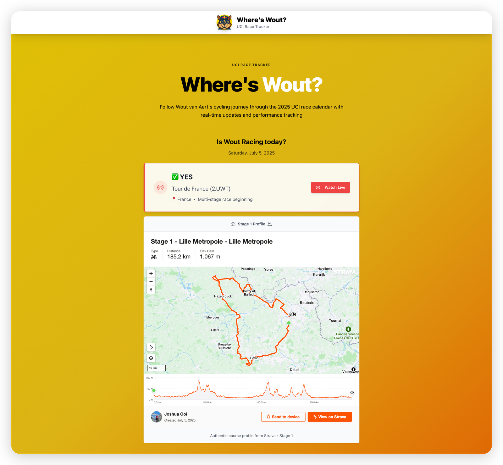
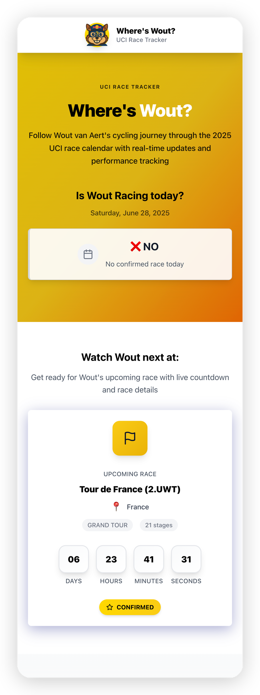
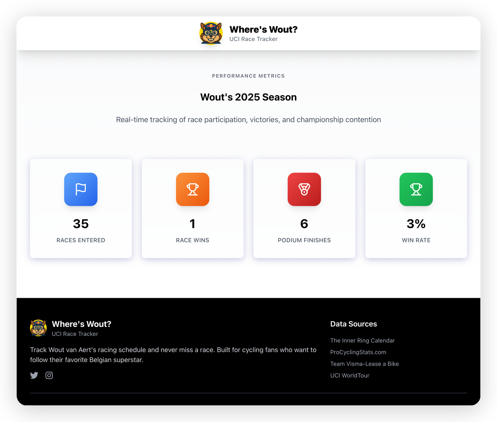

Wout van Aert doesn't race every event on the calendar — his team announces his programme in advance. This tracker displays the races he's confirmed for, shows route profiles, and starts a countdown once a race is announced.

I update it manually when the team confirms his participation. The live data handles the rest — standings, results, and timing as each race unfolds.

It also pulls Wout's yearly stats from ProCyclingStats, scraping his rider page to surface career and season data alongside the race calendar.

Built with React, TypeScript, and Vite on the frontend, with an Express backend handling the data layer.

